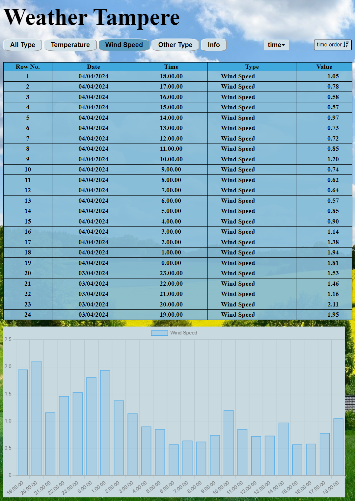

# Weather Data Visualization

This project is a simple weather data visualization tool built with HTML, CSS, and JavaScript. It fetches weather data and displays it in a user-friendly format.

## Project Structure

The project has the following structure:

- `Images/`: This directory contains the images used in the project.
- `index.html`: This is the main HTML file that structures the web page.
- `weather.css`: This file contains all the CSS styles used in the project.
- `weather.js`: This JavaScript file contains the logic for fetching and displaying the weather data.

## Features

- Display weather data for different types: All Type, Temperature, Wind Speed, Other Type, and Info.
- Interactive dropdown menu to select specific weather data type.
- Responsive design that works on different device sizes.

## Usage

To use this project, simply open the `index.html` file in a web browser.

## Contact

For any questions or concerns, please reach out to ej.sobrepena@tuni.fi.

## Acknowledgements

The background image used in this website is from pixabay.com. The image is free for commercial use. For more info about pixabay license, please visit their website.